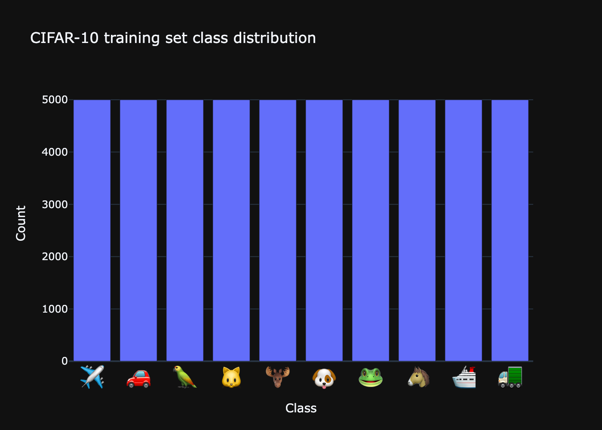
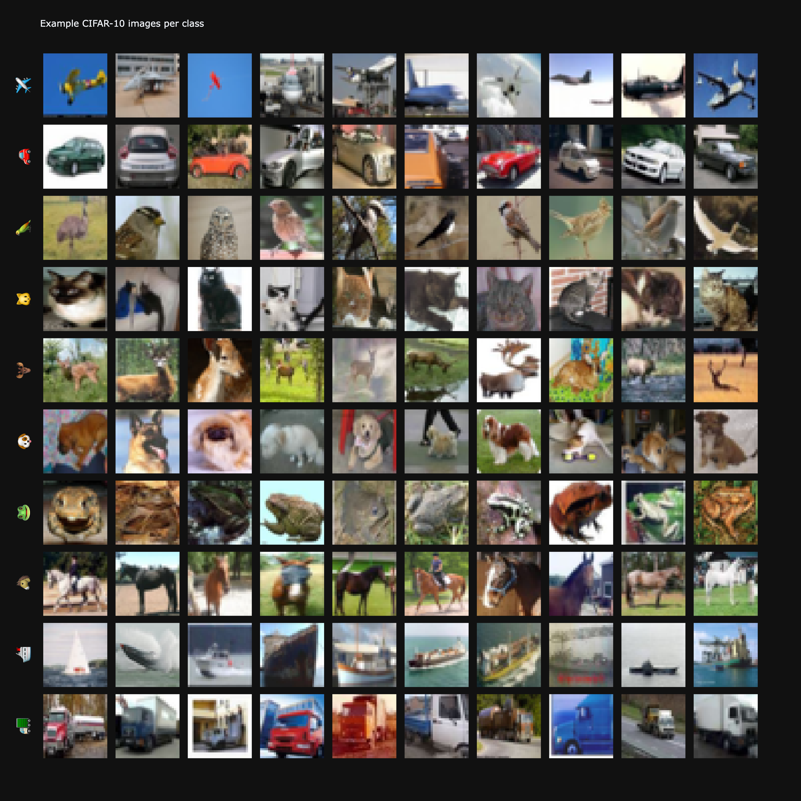

# Computer Vision Project with CIFAR-10 Dataset 👁️‍🗨🖥️️

This project trains and analyses a convolutional neural network (CNN) on the
[CIFAR-10](https://www.cs.toronto.edu/~kriz/cifar.html) image classification dataset.
The focus is not only on model accuracy, but also on **interpretability** through
rich visualisations and error analysis.

---

## 🧠 Model architecture

The core model is a compact CNN built with TensorFlow / Keras using:

- stacked convolutional blocks (Conv2D → BatchNorm → ReLU → MaxPooling → Dropout)
- a dense classification head with softmax over 10 classes

---
## 📂 Project structure

The repository is organised as follows:

```text

Computer-Vision-CIFAR10/
├── docs/                       # Interactive Plotly HTML exports (for GitHub Pages)
│   ├── cifar10_acc.html
│   ├── cifar10_avg_confidence_per_true_class.html
│   ├── cifar10_confidence_hist.html
│   ├── cifar10_confusion_matrix.html
│   ├── cifar10_hard_prediction_grid.html
│   ├── cifar10_loss.html
│   ├── cifar10_misclassification_grid.html
│   ├── cifar10_per_class_accuracy.html
│   ├── cifar10_top_1_percent_correct_predictions.html
│   ├── cifar10_top_1_percent_wrong_predictions.html
│   ├── class_distribution.html
│   └── examples_per_class.html
│
├── models/                     # Saved Keras models
│   └── cifar10_main.keras
│
├── notebooks/                  # Jupyter notebooks (EDA and training)
│   ├── CNN-CIFAR10-NOTEBOOK.ipynb
│   └── EDA.ipynb
│
├── plots/                      # Static PNG previews for README and index.html
│   ├── cifar10_acc.png
│   ├── cifar10_avg_confidence_per_true_class.png
│   ├── cifar10_confidence_hist.png
│   ├── cifar10_confusion_matrix.png
│   ├── cifar10_hard_prediction_grid.png
│   ├── cifar10_loss.png
│   ├── cifar10_misclassification_grid.png
│   ├── cifar10_per_class_accuracy.png
│   ├── cifar10_top_1_percent_correct_predictions.png
│   ├── cifar10_top_1_percent_wrong_predictions.png
│   ├── class_distribution.png
│   └── examples_per_class.png
│
├── results/                    # Serialized training history and metrics
│   └── history_cifar10_main.json
│
├── src/                        # Reusable Python modules
│   └── utils.py
│
├── tests/                      # Unit tests
│   └── test_utils.py
│
├── index.html                  # Landing page for GitHub Pages (interactive gallery)
└── README.md                   # Project documentation (this file)

```


---

## 🌐 Interactive visualizations

All interactive Plotly figures are available on GitHub Pages:

👉 **https://42kiko.github.io/Computer-Vision-CIFAR10/**

The gallery includes:

- dataset overview (class distribution, examples per class)  
- training dynamics (accuracy and loss)  
- confusion matrix and per-class accuracy  
- confidence analysis and detailed grids of correct / wrong predictions  

---

## 📊 Dataset overview

### 📦 Class distribution

This plot shows how many training examples exist for each CIFAR-10 class.  
The dataset is roughly balanced, which is helpful for training the classifier.

Click the image to open the interactive Plotly version in your browser:

[](https://42kiko.github.io/Computer-Vision-CIFAR10/docs/class_distribution.html "Open interactive Plotly version")

---

### 🖼️ Examples per class

This grid visualises several example images for each class.  
It helps to build an intuitive understanding of what the model actually sees
and how visually similar some categories are.

Click the image to open the interactive Plotly version in your browser:

[](https://42kiko.github.io/Computer-Vision-CIFAR10/docs/examples_per_class.html "Open interactive Plotly version")

---

## 📈 Training & evaluation (summary)

In the notebooks and interactive plots you can explore:

- **Training curves**
  - Accuracy and loss over epochs for train and validation sets  
  - Used to check convergence and detect overfitting / underfitting  

- **Confusion matrix & per-class accuracy**
  - Shows which classes are recognised reliably  
  - Highlights pairs of classes that are frequently confused  

- **Confidence & error analysis**
  - Confidence distribution for correct vs wrong predictions  
  - Top 1 % most confident correct and wrong predictions  
  - “Hard but correct” edge cases and misclassification grids  

For full details, see the notebooks in `notebooks/` and the interactive
visualisations on the GitHub Pages dashboard linked above.